# 读《深入理解计算机系统》（二）


- [读《深入理解计算机系统》（一）](https://github.com/ShannonChenCHN/what-is-computer-science/blob/master/posts/%E8%AF%BB%E3%80%8A%E6%B7%B1%E5%85%A5%E7%90%86%E8%A7%A3%E8%AE%A1%E7%AE%97%E6%9C%BA%E7%B3%BB%E7%BB%9F%E3%80%8B_01.md)
- [读《深入理解计算机系统》（二）](https://github.com/ShannonChenCHN/what-is-computer-science/blob/master/posts/%E8%AF%BB%E3%80%8A%E6%B7%B1%E5%85%A5%E7%90%86%E8%A7%A3%E8%AE%A1%E7%AE%97%E6%9C%BA%E7%B3%BB%E7%BB%9F%E3%80%8B_02.md)
- [读《深入理解计算机系统》（三）](https://github.com/ShannonChenCHN/what-is-computer-science/blob/master/posts/%E8%AF%BB%E3%80%8A%E6%B7%B1%E5%85%A5%E7%90%86%E8%A7%A3%E8%AE%A1%E7%AE%97%E6%9C%BA%E7%B3%BB%E7%BB%9F%E3%80%8B_03.md)
- [读《深入理解计算机系统》（四）](https://github.com/ShannonChenCHN/what-is-computer-science/blob/master/posts/%E8%AF%BB%E3%80%8A%E6%B7%B1%E5%85%A5%E7%90%86%E8%A7%A3%E8%AE%A1%E7%AE%97%E6%9C%BA%E7%B3%BB%E7%BB%9F%E3%80%8B_04.md)


## 目录
- 第一部分 程序结构和执行
  - 第2章　信息的表示和处理
    - 2.1 信息存储
    - 2.2 整数表示
    - 2.3 整数运算
    - 2.4 浮点数
  - 第3章　程序的机器级表示
    - 3.1 历史观点
    - 3.2 程序编码
    - 3.3 数据格式
    - 3.4 访问信息
    - 3.5 算术和逻辑操作
    - 3.6 控制
    - 3.7 过程
    - 3.8 数组分配和访问
    - 3.9 异数的数据结构
    - 3.10 在机器级程序中将控制与数据结合起来
    - 3.11 浮点代码
  - 第4章　处理器体系结构
    - 4.1 Y86-64 指令集体系架构
    - 4.2 逻辑设计和硬件控制语言 HCL
    - 4.3 Y86-64 的顺序实现
    - 4.4 流水线的通用原理
    - 4.5 Y86-64 的流水线实现
  - 第5章　优化程序性能
    - 5.1 优化编译器的能力和局限性
    - 5.2 表示程序性能
    - 5.3 程序示例
    - 5.4 消除循环的低效率
    - 5.5 减少过程调用
    - 5.6 消除不必要的内存引用
    - 5.7 理解现代处理器
    - 5.8 循环展开
    - 5.9 提高并行性
    - 5.10 优化合并代码的结果小结
    - 5.11 一些限制因素
    - 5.12 理解内存性能
    - 5.13 应用：性能提高技术
    - 5.14 确认和消除性能瓶颈
  - 第6章　存储器层次结构
    - 6.1 存储技术
    - 6.2 局部性
    - 6.3 存储器层次结构
    - 6.4 高速缓存存储器
    - 6.5 编写高速缓存友好的代码
    - 6.6 综合：高速缓存对程序性能的影响


## 第一部分 程序结构和执行
## 第 2 章 信息的表示和处理

这一章主要讨论计算机是如何表示和处理数字（整数、小数）和其他形式的数据。

## 问题
- 不同进制之间如何转换？
- 计算机为什么用二进制来表示信息？
- 二进制中的负数怎么表示？
- 补码是什么？补码是怎么来的？
- 计算机中的浮点数是怎么表示的？
- int，int32 和 int64 的区别？为什么会有 int32 和 int64 这种数据类型？
- 现定义有 `float a = 102100.00 * 2` 和 ` float b = 0.1` 两个变量，将 a 和 b 相加得到应该是 204200.10，但是实际得到的却是 204200.09，这是为什么？


### 2.1 信息存储

在计算机中，所有的信息都是以 0 和 1 的形式存储和处理的。

一个字节有 8 位，字节是最小的可寻址内存单位，也就是说我们在访问计算机内存时，不是直接访问内存中单独的位，而是字节。

程序将内存看做一个非常大的字节数组，也就是我们常说的虚拟内存。内存的每个字节都由一个唯一的数字来标识，我们把这个数字称作地址。所有可能地址的集合就被称为虚拟地址空间。

从虚拟地址空间这个名字可以看出，这个虚拟地址空间只是一个展现给机器级程序的概念性映像。实际的实现是动态随机访问存储器、闪存、磁盘、和操作系统软件等结合起来，为程序提供一个看上去统一的字节数组。


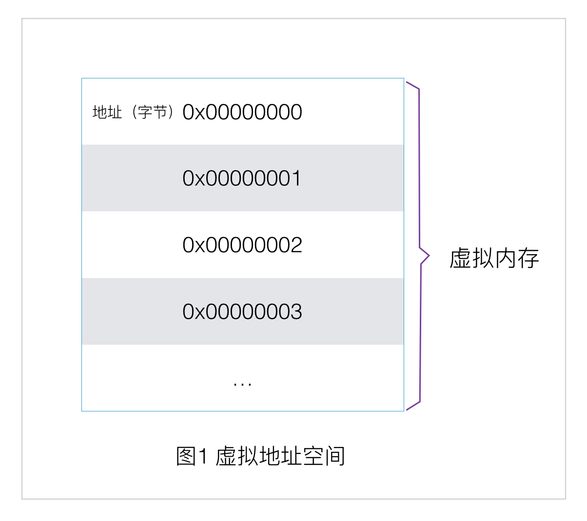

基于此，编译器和运行时系统将存储器空间划分成更可管理的单元，来存放不同的程序对象（即程序数据、指令和控制信息）。每个程序对象可以简单地视为一个字节块，而程序本身就是一个字节序列。

#### 2.1.1 十六进制表示法

- 为什么要使用十六进制来表示字节，而不是十进制和二进制？
  - 二进制太冗长，十进制与二进制之间的转换比较麻烦
- 如何表示十六进制
  - 使用数字 0~9 和字符 A~F 来表示
  - C 语言中，以 0x 或 0X 开头的数字常量表示十六进制数

其他进制转十进制：

```
101011 = 1 * 2^0 + 1 * 2^1 + 0 * 2^2 + 1 * 2^3 + 0 * 2^4 + 1 * 2^5 = 43
0x104 = 4 * 16^0 + 0 * 16^1 + 1 * 16^2 = 260
```

将十进制转成其他进制的数：
```
while(商不为0) {
  用基数除这个十进制数
  把余数作为最终结果的最左边的一位
  用商替代这个十进制数
}
```


十进制转二进制：
```

基数  商      余数

 2 ┃  43
   ┗━━━━━━
 2 ┃  21   …… 1
   ┗━━━━━━
 2 ┃  10   …… 1
   ┗━━━━━━
 2 ┃   5   …… 0
   ┗━━━━━━
 2 ┃   2   …… 1
   ┗━━━━━━
 2 ┃   1   …… 0
   ┗━━━━━━
       0   …… 1

十进制 43 就等于二进制 101011

```

十进制转十六进制：
```
基数  商      余数

 16 ┃  260
    ┗━━━━━━━
 16 ┃   16  …… 4
    ┗━━━━━━━
 16 ┃    1  …… 0
    ┗━━━━━━
         0  …… 1

十进制 260 就等于十六进制 0x104
```

十六进制转二进制：
```
基本原则是，十六进制的一位相当于二进制中的四位。

0x104 = 0001 0000 0100
```

**延伸阅读**
- [https://www.cnblogs.com/gaizai/p/4233780.html](https://www.cnblogs.com/gaizai/p/4233780.html)


#### 2.1.2 字数据大小

- 每台计算机都有一个字长，指明指针数据的标称大小。
  - 因为虚拟地址就是以这样的一个字来编码的，所以字长决定的最重要的系统参数就是虚拟地址空间的最大大小。
  - 比如 32 位的机器上，虚拟地址的范围就是 `0` ~ `2^32 - 1`，而指针就是用来表示地址的，所以要想能够表示所有可能的地址，一个指针变量占 4 个字节，正好可以容下所有可能的虚拟地址大小；同理，在 64 位的机器上，一个指针变量占 8 个字节。
- 大多数 64 位机器也可以运行 32 位机器编译的程序，也就是向后兼容。但是 32 位机器只能运行 32 位机器编译的程序。
  - 我们将程序成为“32 位程序”或 “64 位程序”时，区别在于该程序是如何编译的，而不是其运行的机器类型
- 计算机和编译器支持多种不同方式编码的数字格式，比如不同长度的整数和浮点数。
  - 有些数据类型的确切字节数取决于程序是如何被编译的。（见下图中 C 语言各种数据类型分配的字节数）
  - 为了保证通用性，ISO C99 引入了固定大小的数据类型，不随编译器和机器设置而变化，比如 int32_t 和 int64_t，它们分别为 4 个字节和 8 个字节。这样，程序员就可以准确保证数据类型的大小是确定的了。
- 在编写程序时，应尽量考虑到程序的可移植性。

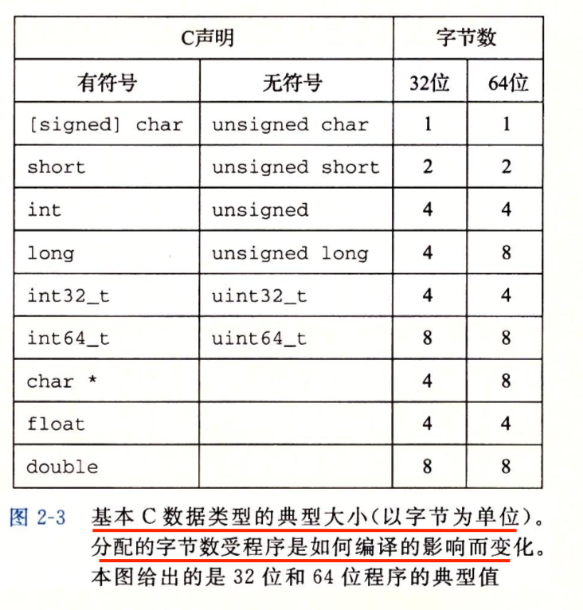

#### 2.1.3 寻址和字节顺序

- 多字节变量的存储规则
  - 多字节变量一般被存储为连续的字节序列，变量的地址就是所使用字节空间中最小的地址。（如下图所示）
- 排列表示一个变量的字节有两种规则
  - 小端法：最低有效字节在最前面。大多数 Intel 兼容机都只用小端模式，我正在使用的 Mac 也是如此。
  - 大端法：最高有效字节在最后面
- 案例：写一个 C 程序，使用强制类型转换来访问和打印不同程序变量的字节表示


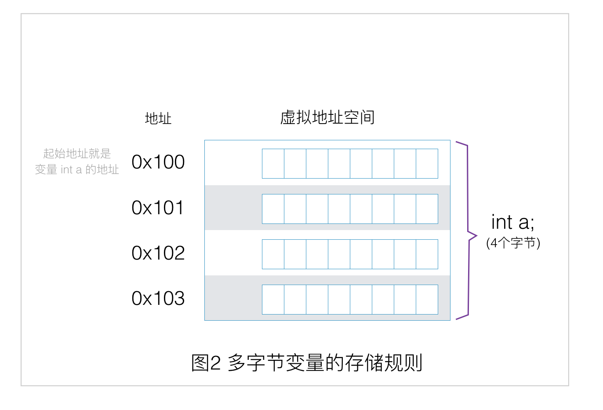

 

以下是试验代码：

```C

typedef unsigned char *byte_pointer;


/**
 打印十六进制形式的字节表示

 @param start 该变量的起始地址
 @param len 该数据类型的字节大小
 */
void show_bytes(byte_pointer start, size_t len) {
    size_t i;
    
    for (i = 0; i < len; i++) {
        printf(" %.2x", start[i]);
    }
    
    printf("\n");
}


/**
 打印 int 类型变量的字节表示

 @param x <#x description#>
 */
void show_int(int x) {
    show_bytes((byte_pointer)&x, sizeof(int));
}


/**
 打印 float 类型变量的字节表示

 @param x <#x description#>
 */
void show_float(float x) {
    show_bytes((byte_pointer)&x, sizeof(float));
}

/**
 打印 指针 类型变量的字节表示
 
 @param x <#x description#>
 */
void show_pointer(void *x) {
    show_bytes((byte_pointer)&x, sizeof(void *));
}


/**
 打印 字符串 类型变量的字节表示

 @param str 字符串
 @param len <#len description#>
 */
void show_string(char *str, size_t len) {
    show_bytes((byte_pointer)str, len);
}

/**
 测试用例

 @param val <#val description#>
 */
void test_show_bytes(int val) {
    int ival = val;
    float fval = (float)ival; // 强转成 float
    int *pval = &ival; // 获取变量地址
    show_int(ival);
    show_float(fval);
    show_pointer(pval);
}


int main(int argc, const char * argv[]) {
    
    
    test_show_bytes(12345);
    
    char str[] = "12345";
    show_string(str, 6);
    
    return 0;
}

```

输出结果：
```
 39 30 00 00
 00 e4 40 46
 88 f5 bf ef fe 7f 00 00
 31 32 33 34 35 00
```


#### 2.1.4 计算机中的字符串是如何表示的

- 所有的字符都是被编码过的，一个字符对应一个编码
- 常见的编码方式有 ASCII、UTF-8
- C 语言中的字符串实际上是一个数组，字符串是由字符组成的，最后结尾的字符是 '\0'


#### 2.1.5 计算机中的代码是如何表示的

- 从机器的角度来讲，程序就是字节序列
- 不同的机器类型使用不同的指令和编码方式


#### 2.1.6 布尔代数


- 布尔代数将逻辑值 FALSE 和 TRUE 编码成二进制值 0 和 1 进行非、与、或、异或等逻辑运算。


#### 2.1.7 C 语言中的按位布尔运算

- C 语言支持按位布尔运算
- 位运算的一个常见用法——掩码
  - 通过将源码与掩码进行位运算，从而从源码中选出指定位的组合。
  - 比如，将 0x89ABCDEF 与掩码 0xFF 进行与运算，得到 0x000000EF，在这里，这个掩码的作用就是获取最低位的字节


**延伸阅读**        
- [掩码 - 百度百科](https://baike.baidu.com/item/%E6%8E%A9%E7%A0%81)
- [子网掩码怎么理解？ - 师爷快上的回答 - 知乎](https://www.zhihu.com/question/56895036/answer/154192558)

#### 2.1.8 C 语言中的逻辑运算

- C 语言中还提供了一组逻辑运算符 `||`、`&&` 和 `!`
- 逻辑运算认为所有的非零参数都表示 TRUE，而参数 0 表示 FALSE，计算结果为 0 或者 1

#### 2.1.9 C 语言中的移位运算

- C 语言中支持移位运算
- 一般情况下，机器支持两种形式的右移运算
   - 逻辑右移：右移 k 位，就在最左端补 k 个 0 
   - 算术右移：右移 k 位，在最左端补 k 个最高有效位的值，也就是说，最高位是0，就补0，最高位是 1，就补 1
- 实际上，几乎所有的编译器、及其组合都对有符号数使用算术右移

### 2.2 整数表示

#### 2.2.1 整型数据类型

- C 语言支持多种整型数据类型，也就是表示有限范围的整数。
- 一个整型数据类型的变量实际可以表示的范围在不同编译情况下（32位 or 64 位）可能有所不同，比如 long 在 64 位机器上使用 8 个字节表示，而在 32 位机器上使用 4 个字节表示。
- 不过，C 语言标准定义了每种数据类型必须能够表示的**最小**的取值范围。（如下图所示）


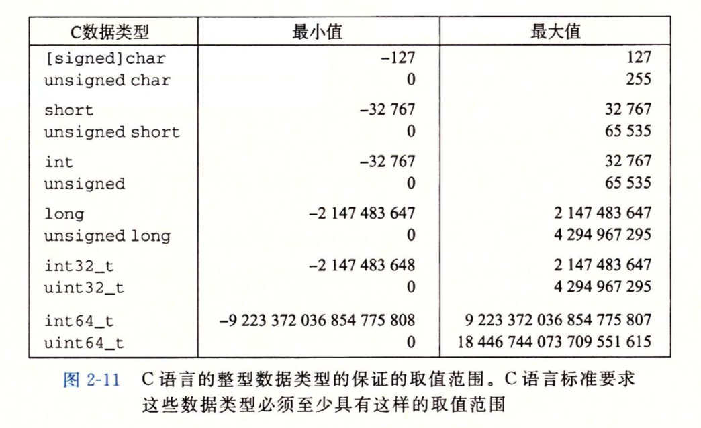

**延伸阅读**    
- [C 语言的 int 类型变量范围是多少？ - Pagefault的回答 - 知乎](https://www.zhihu.com/question/19580654/answer/12283278)

#### 2.2.2 无符号数的编码

- 无符号数的二进制编码有一个重要特点，也就是每个介于 0 ~ `2^w - 1` 之间的数都有唯一一个 w 位的值编码（这里假设一个整数数据类型有 w 位）
  - 比如，十进制数 11 是一个无符号数，它就只有一个 4 位的表示，`1011`

#### 2.2.3 补码编码


- 计算机中使用补码表示法来表示负数
- 值得注意的是，补码的范围是不对称的：`|TMin| = |TMax| + 1`
- 在某些情况下，用某个确定大小的数据类型来表示数据很重要，ISO C99 标准在文件 `stdint.h` 中引入了一个整数类型类，这个文件中定义了一组数据类型，它们都是以 `intN_t` 和 `uintN_t` 这种形式的宏声明的，这些数据类型对不同的 N 值指定 N 位有符号和无符号整数


#### 2.2.4 有符号数和无符号数之间的转换

- C 语言中允许在各种不同的数字数据类型之间做强制类型转换
- C 语言中的类型转换有两种
  - 显式转换
  - 隐式转换
- 强制类型转换不会改变原数据的二制位值，只是改变了解释这些位的方式


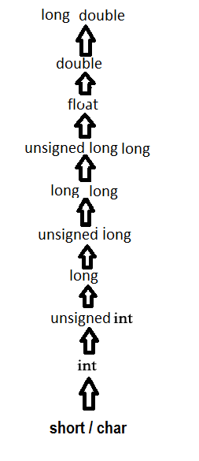
<p style="text-align: center">Type Casting In C Language</p>


测试代码：
```C
    short int v = -12345;
    unsigned short uv = (unsigned short)v;
    printf("v = %d, uv = %u\n", v, uv);
    
    show_bytes((byte_pointer)&v, sizeof(short int));
    show_bytes((byte_pointer)&uv, sizeof(unsigned short));

```

输出结果：
```
v = -12345, uv = 53191
 c7 cf
 c7 cf
```

#### 2.2.5 C 语言中的有符号数与无符号数

- C 语言标准没有指定有符号数要采用某种表示，但是几乎所有机器都是用补码来表示有符号数
- 大多数数字都默认是有符号的，要创建一个无符号常量，必须加上后缀字符 'U' 或者 'u'


#### 2.2.6 扩展一个数字的位表示

- 将一个无符号数转换成一个更大的数据类型，我们只需要在开头添加 0 就可以了，也就是零扩展
- 将一个补码数字（负数）转换成一个更大的数据类型，可以执行一个符号扩展，也就是在表示中添加最高有效位的值


测试代码：
```C
    short sx = -12345;
    unsigned short usx = sx;
    int x = sx;
    unsigned ux = usx;
    
    printf("sx = %d:\t", sx);
    show_bytes((byte_pointer)&sx, sizeof(short));
    printf("usx = %u:\t", usx);
    show_bytes((byte_pointer)&usx, sizeof(unsigned short));
    printf("x = %d:\t", x);
    show_bytes((byte_pointer)&x, sizeof(int));
    printf("ux = %u:\t", ux);
    show_bytes((byte_pointer)&ux, sizeof(unsigned));
```

结果：
```
sx = -12345:   c7 cf
usx = 53191:   c7 cf
x = -12345:  c7 cf ff ff
ux = 53191:  c7 cf 00 00
```

#### 2.2.7 截断数字

- 当我们将一个数字强制转换为可表示范围更小的类型后，这个数字的位就会减少，这就是截断
- 当将一个 w 位的数截断为一个 k 位数字时，我们会丢弃高 w-k 位

#### 2.2.8 关于有符号数与无符号数的建议

有符号数到无符号的隐式转换可能会导致一些难以发现的 bug。

测试代码：
```C
    unsigned int a = 0;
    printf("%u\n", (a - 1)); 
    if (a - 1 > 0) {
        printf("a is bigger than 1.\n");
    }
```

输出结果：   
```
4294967295
a is bigger than 1.
```


### 2.3 整数运算

- 无符号加法
- 补码加法
- 补码的非
- 无符号乘法
- 补码乘法
- 乘以常数
- 除以 2 的幂
- 关于整数运算的最后思考

### 2.4 浮点数

#### 2.4.1 二进制小数 ※

二进制小数跟十进制小数的表示类似，比如下面的例子。

十进制小数：
```
3.14 = 3 * 10^0 + 1 * 10^(-1) + 4 * 10^(-2)
```

二进制小数：
```
1.011 = 1 * 2^0 + 0 * 2^(-1) + 1 * 2^(-2) + 1 * 2^(-3) = 1 + 0 + 0.25 + 0.125 = 1.375（十进制） 
```

小数的二进制表示法只能表示那些被写成 x * 2^y 的数，其他的值只能被近似地表示。


#### 2.4.2 IEEE 浮点表示 ※

- IEEE 浮点标准：`V = (-1)^s x M x 2^E`
- 单精度（float）和双精度（double）
- 根据 exp 的值，被编码的值可以分成三种不同的情况
  - 规格化的
  - 非规格化的
  - 无穷大
  - NaN


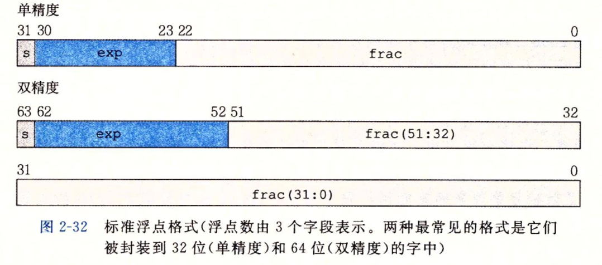


#### 2.4.3 舍入（Rounding）


- IEEE 浮点个事定义了四种不同的舍入方式
  - 向偶数舍入（默认）
  - 向零舍入
  - 向下舍入
  - 向上舍入


#### 2.4.4 浮点运算


#### 2.4.5 C 语言中的浮点数

## 第 3 章 程序的机器级表示

这一章主要介绍 C 语言、汇编语言和机器代码之间的关系，以及机器级别的代码是如何执行的，包括基本的控制语句、数组、结构体的本质。本章的目标是能够阅读和理解编译器产生的代码，以及理解机器级别的指令是如何执行的，并且能够利用逆向技术来推测一些程序的源码。

理解汇编代码以及它与原始 C 代码的联系，是理解计算机如何执行程序的关键一步。

### 问题
- 高级语言的终极形态是什么？
- 为什么我们需要高级语言？
- 机器语言、汇编语言和高级语言的关系？
- 我们为什么需要学习汇编语言？

### 3.1 历史观点

### 3.2 程序编码

gcc 编译 C 代码的流程：预处理 -> 编译 -> 汇编 -> 链接


#### 3.2.1 机器级代码

- 机器级编程的两种抽象
  - 指令集体系架构
  - 虚拟内存地址
- 程序内存包括以下几个部分
  - 程序的可执行机器代码
  - 操作系统需要的一些信息
  - 用来管理过程调用和返回的运行时栈
  - 用户分配的内存块（比如调用 malloc 库函数分配的内存）
- 使用 gcc 编译 c 代码
- 使用 objdump 反汇编目标文件


反汇编示例：

```C
long mult2(long, long);

void multstore(long x, long y, long *dest) {

  long t = mult2(x, y);
  *dest = t;
}
```

经过 gcc 编译生成的汇编代码：
```
_multstore:                             ## @multstore
  .cfi_startproc
## %bb.0:
  pushq %rbp
  .cfi_def_cfa_offset 16
  .cfi_offset %rbp, -16
  movq  %rsp, %rbp
  .cfi_def_cfa_register %rbp
  pushq %rbx
  pushq %rax
  .cfi_offset %rbx, -24
  movq  %rdx, %rbx
  callq _mult2
  movq  %rax, (%rbx)
  addq  $8, %rsp
  popq  %rbx
  popq  %rbp
  retq
  .cfi_endproc
```

反汇编代码：
```
_multstore:
0:  55  pushq %rbp
1:  48 89 e5  movq  %rsp, %rbp
4:  53  pushq %rbx
5:  50  pushq %rax
6:  48 89 d3  movq  %rdx, %rbx
9:  e8 00 00 00 00  callq 0 <_multstore+0xe>
e:  48 89 03  movq  %rax, (%rbx)
11: 48 83 c4 08   addq  $8, %rsp
15: 5b  popq  %rbx
16: 5d  popq  %rbp
17: c3  retq

```

#### 3.2.2 汇编代码格式

- 所有以 “.”开头的行都是指导汇编器和链接器工作的伪指令

#### 3.2.3 C 与汇编的混合编程

- 虽然 C 编译器可以把 C 程序中表达的计算转换到机器代码，但是仍然有一些机器特性是 C 程序访问不到的
- 在 C 程序中插入汇编代码有两种方式
  - 第一种是，在一个单独的文件中用汇编代码编写完整的函数，然后让汇编器和链接器把它和用 C 语言写的代码合并起来
  - 第二种方式是，使用 GCC 的内联汇编特性，用 asm 伪指令在 C 程序中嵌入一些简单的汇编代码

#### 一些工具
- gcc：一个跨平台的编译器，支持编译多种高级语言，包括 C、C++、Objective-C 等。
- objdump：一种用来查看可执行文件的信息的 gcc 工具，也就是以一种可阅读的格式让你更多地了解二进制文件可能带有的附加信息。


#### 常用的 gcc 命令

将两个 C 源文件编译成可执行文件：
```
> gcc -Og -o p p1.c p2.c

```

将 C 源代码编译成汇编代码：
```
> gcc -Og -S source_file.c
```

将 C 源代码编译成二进制的目标文件：
```
> gcc -Og -c source_file.c
```

#### 常用 objdump 命令

根据机器代码生成汇编格式的代码：
```
> objdump -d source_file.o
```

**延伸阅读**  
- [GCC编译器（Linux GCC命令）30分钟教程 - C语言中文网](http://c.biancheng.net/gcc/)
- [objdump命令_Linux objdump 命令用法详解：显示二进制文件信息](http://man.linuxde.net/objdump)

### 3.3 数据格式


- 大多数 GCC 生成的汇编代码指令都有一个字符的后缀，表明操作数的大小。
  - 比如，数据传送指令有四个变种：movb（传送字节）、movw（传送字）、movl（传送双字）和 movq（传送四字）

### 3.4 访问信息

一个 x86-64 的 CPU 包含一组 16 个存储 64 位值的通用目的寄存器，这些寄存器用来存储整数数据和指针。

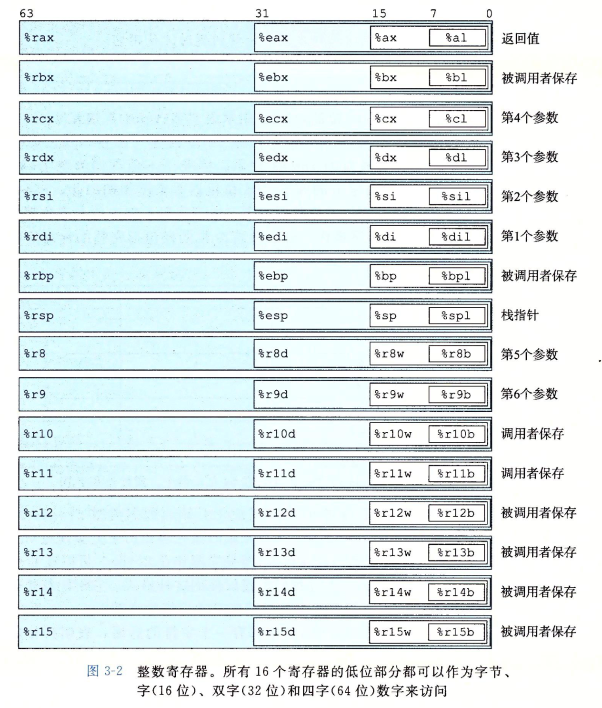

#### 3.4.1 操作数指示符

- 什么是操作数？
  - 大多数汇编指令后面会有一个或者多个操作数，用来指定执行一个操作中要使用的源数据，以及保存结果的目标位置，比如 `addq  $8, %rsp` 中的 `$8` 和 `%rsp`。源数据可以以常数形式给出，也可以是从寄存器或内存中读出，结果可以存放在寄存器或内存中。
- 操作数的三种类型
  - 立即数
  - 寄存器
  - 内存引用
- 因为有多种不同的寻址模式，所以可以有不同形式的内存引用
  - 下表中的 Imm(r_b, r_i, s) 是最常用的形式，这样的引用有四个组成部分
    - 立即数偏移 Imm
    - 基址寄存器 r_b
    - 变址寄存器 r_i
    - 比例因子 s


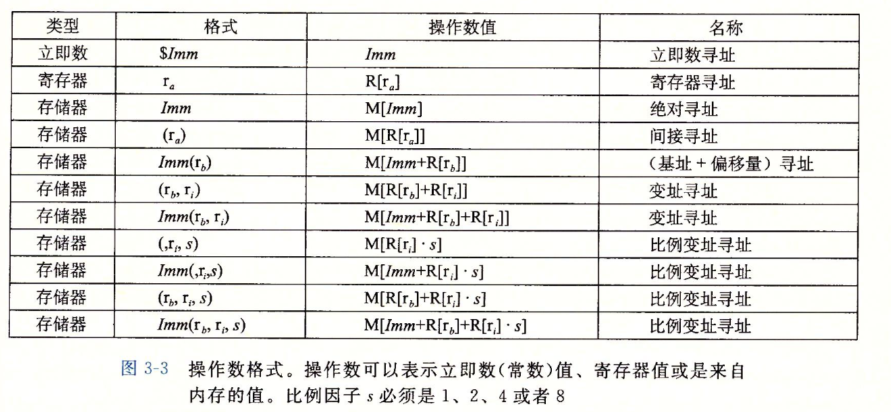
<p style="text-align: center;">x86-64 支持的操作数格式</p>

注：       
1. “Imm” 表示**立即数**（immediate），也就是一个常数值，比如 0x104。
2. “r” 表示**寄存器（register）名字**（比如 %rax 这种形式），我们用引用 R[r] 来表示这个寄存器的值（它是一个值，比如 0x101），这是将寄存器看做一个数组 R，用寄存器标识符作为索引。
3. “(r)” 表示的是一个**内存引用**，也就是一个内存地址，只不过它是根据寄存器中存的地址来访问某个内存位置。
4. 这里我们用 “M[Addr]” 表示对存储在内存中从地址 Addr 开始的多个字节值的引用，它是一个值，比如 0x101。


#### 3.4.2 数据传送指令

- 数据传送指令是最常用的指令，它用来将数据从源位置复制到目标位置
- 最简单形式的数据传送指令是 MOV 类指令
- MOV 类指令由四条指令组成，这四条指令的主要区别在于它们操作的数据大小不同
  - movb（b代表1个字节）
  - movw（w代表1个字，2个字节）
  - movl（l代表2个字，4个字节）
  - movq（q代表4个字，8个字节）
- 传送指令的两个操作数不能都指向内存位置，也就是说只允许同时出现一个作为内存引用的操作数（也就是 `(%rax)` 这种形式的操作数）
- MOV 类指令的最后一个字符（“b”，“w”，“l” 和 “q”），与作为内存引用的操作数无关，而与作为寄存器的操作数有关，寄存器的长度必须跟指令的最后一个字符指定的大小相匹配
- 从较大的源复制到较小的目的时，按最大的值算，也就是源的值的大小（可以这么理解？？）
- 除了 MOV 类指令之外，另外还有两类指令用于将较小的源值复制到较大的目的
  - MOVZ 类指令（源无符号，把目的中剩余的字节填充为 0）
  - MOVS 类指令（源有符号，通过符号扩展来填充，把源操作的最高位进行复制）
- MOVZ 类指令和 MOVS 指令最后两个字符都是大小指示符
  - 第一个字符指定源的大小
  - 第二个字符指定目的的大小


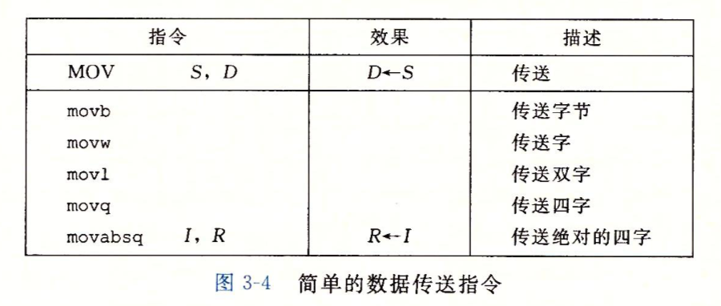
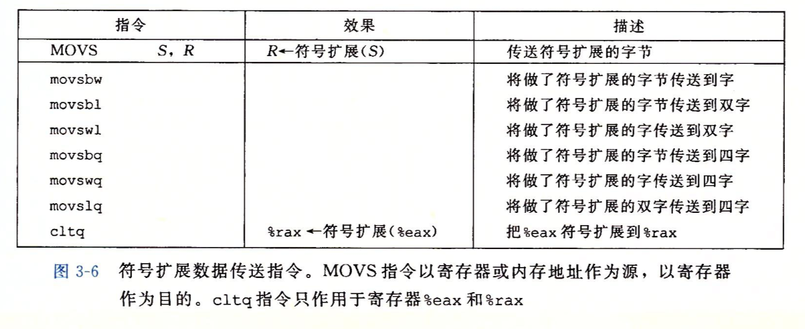


下面的 MOV 指令示例给出了源和目的类型的五种可能的组合（第一个是源操作数，第二个是目的操作数）


注：          
1. Immediate 不能作为目的操作数；
2. 源操作数和目的操作数不能都是 Memory；

**参考资料**
- [《深入理解计算机系统》 练习题3.2-3.5 汇编相关](https://blog.csdn.net/anlian523/article/details/83997464)

#### 3.4.3 数据传送实例

C 语言代码：
```c
long exchange(long *xp, long y) {
    long x = *xp;
    *xp = y;
    return x;
}

```

gcc 转成的汇编代码：
```
// long exchange(long *xp, long y)
// xp in rdi, y in rsi, x in rbp
_exchange:                              
  pushq %rbp              
  movq  %rsp, %rbp        
  movq  (%rdi), %rax      // 把 xp 所引用的值赋给 x，并将 x 作为返回值
  movq  %rsi, (%rdi)      // 将 y 的值保存到 xp 引用
  popq  %rbp              
  retq
```

从上面的汇编代码中可以看出两个要点：       
1. C 语言中的“指针”其实就是地址，间接引用指针就是将该指针放在一个寄存器中，然后在内存引用中使用这个寄存器；
2. 像 x 这样的局部变量通常是是保存在寄存器中，而不是内存中。


#### 3.4.4 压入和弹出栈数据

> 注：这一节没有看太明白

- 什么是栈？
  - 栈是一种数据结构，可以添加和删除元素，因为只能从一端操作元素，所以遵循“后进先出”原则
- 栈顶：可以插入和删除元素的一端称为栈顶
- 栈的作用是什么？
  - 调用函数时保存局部变量和原函数地址
- 栈存放在什么地方？
  - 内存中
- 栈操作的指令是什么？
  - push 和 pop，这两个指令也会根据不同大小的操作数带上后缀（b、w、l、q）


**延伸阅读**
- [理解 stack --- 函数是如何调用的](http://wsfdl.com/linux/2015/05/16/%E7%90%86%E8%A7%A3stack-func.html)
- [x86-64 下函数调用及栈帧原理](https://zhuanlan.zhihu.com/p/27339191)

### 3.5 算术和逻辑操作

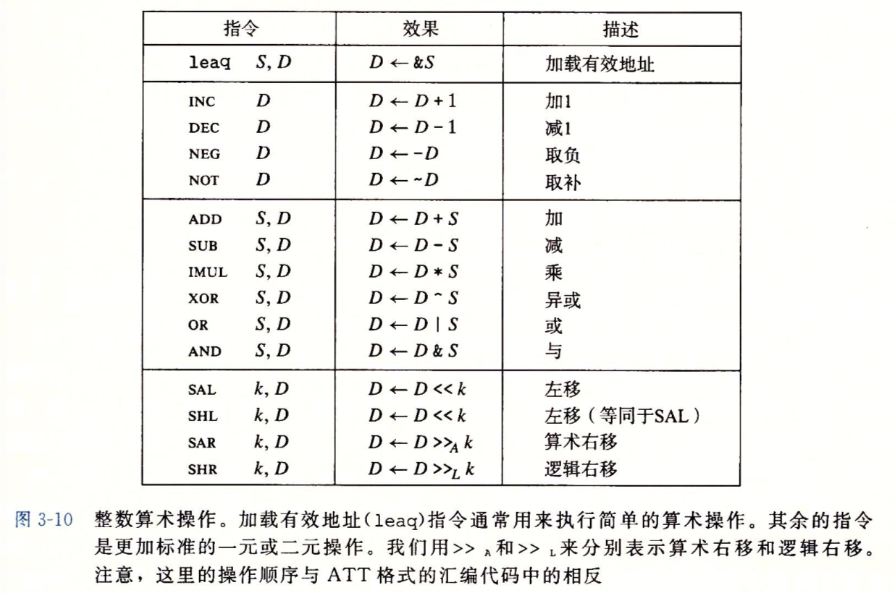

x86-64 的算术和逻辑操作都被分成了指令类，这些指令类有各种针对不同大小操作数的变种（根据后缀 b、w、l、q 可以判断出），这些操作数可以被分为四组（如上图所示）：       
- 加载有效地址
- 一元操作
- 二元操作
- 移位操作


#### 3.5.1 加载有效地址


leaq 指令实际上是 movq 指令的变形，leaq 指令看上去像是从内存中读取数据到寄存器，但是实际上它并没有引用内存，正确的理解是，这条指令并不是从指定的位置读入数据，而是将有效地址写入到目的操作数。所以，它也可以用来描述普通的算术操作。

比如，我们假设寄存器 %rdx 的值为 x，那么指令 `leaq 7(%rdx, %rdx, 4), %rax`  表示设置寄存器 %rax 的值为 `5x+7`。


下面是将一个 C 函数编译成汇编后的效果：

```C
long scale(long x, long y, long z) {
    long t = x + 4 * y + 12 * z;
    return t;
}


/*
生成的部分汇编代码（x 存在 %rdi 中，y 存在 %rsi 中，z 存在 %rdx 中）：
  pushq %rbp
  movq  %rsp, %rbp
  leaq  (%rdi,%rsi,4), %rax     // x + 4 * y
  leaq  (%rdx,%rdx,2), %rcx     // z + 2 * z = 3 * z
  leaq  (%rax,%rcx,4), %rax     // x + 4 * y + 4 * (3 * z) 
  popq  %rbp
  retq

*/

```


#### 3.5.2 一元和二元操作


一元操作只有一个操作数，既是源又是目的。一元操作看上去像 C 语言中的 `a++`、`a--`。

二元操作有两个操作数，第二个操作数既是源又是目的。二元操作看上去像 C 语言中的 `x-=y`。

#### 3.5.3 移位操作

移位操作有两个操作数，第一个是移位量，第二个是要移位的数。移位量可以是一个立即数，也可以放在单字节寄存器 %cl 中（移位操作有些特别，只允许以这个特定的寄存器作为操作数）。

移位操作有 4 个指令，两个左移指令（SAL 和 SHL）和两个右移指令（SAR 和 SHR）。


左移 n 位相当于乘以 2^n，右移 n 位相当于除以 2^n。


遗留问题：练习题 3.9 和 3.11。


#### 3.5.4 特殊的算术操作

- 支持两个 128 位数乘积的指令
  - imulq
  - mulq
- 整数除法指令
  - idivq
  - divq
  - cqto


### 3.6 控制

#### 3.6.1 条件码


#### 3.6.2 访问条件码


#### 3.6.3 跳转指令


#### 3.6.4 跳转指令的编码


#### 3.6.5 用条件控制来实现条件分支


#### 3.6.6 用条件传送来实现条件分支


#### 3.6.7 循环


#### 3.6.8 switch 语句


### 3.7 过程

- 运行时栈
- 转移控制
- 数据传送
- 栈上的局部存储
- 寄存器中的局部存储空间
- 递归过程


### 3.8 数组分配和访问

- 基本原则
- 指针运算
- 嵌套的数组
- 定长数组
- 变长数组


### 3.9 异质的数据结构

- 结构体
- 联合体
- 数据对齐


### 3.10 在机器级程序中将控制和数据结合起来

- 理解指针
- 应用：使用 GDB 调试器
- 内存越界引用和缓冲区溢出
- 对抗缓冲区溢出攻击
- 支持变长栈帧


### 3.11 浮点代码

- 浮点传送和转换操作
- 过程中的浮点代码
- 浮点运算操作
- 定义和使用浮点常数
- 在浮点代码中使用位级操作
- 浮点比较操作
- 对浮点代码的观察结论


## 第 4 章 处理器体系结构


### 4.1 Y86-64 指令集体系架构


- 程序员可见的状态
- Y86-64 指令
- 指令编码
- Y86-64 异常
- Y86-64 程序
- 一些 Y86-64 指令的详情

### 4.2 逻辑设计和硬件控制语言 HCL

- 逻辑门
- 组合电路和 HCL 布尔表达式
- 字级的组合电路和 HCL 整数表达式
- 集合关系
- 存储器和时钟


### 4.3 Y86-64 的顺序实现


- 将处理组织成阶段
- SEQ 硬件结构
- SEQ 的时序
- SEQ 阶段的实现

### 4.4 流水线的通用原理

- 计算流水线
- 流水线操作的详细说明
- 流水线的局限性
- 带反馈的流水线系统

### 4.5 Y86-64 的流水线实现


- SEQ+：重新安排计算阶段
- 插入流水线寄存器
- 对信号进行重新排列和标号
- 预测下一个 PC
- 流水线冒险
- 异常处理
- PIPE 各阶段的实现
- 流水线控制逻辑
- 性能分析
- 未完成的工作


## 第5章　优化程序性能


写程序的两个目标：首先是实现功能，能够正常工作；其次是跑的快。

编写高效程序的几个入手点：       
- 选择合适的算法和数据结构
- 编写出编译器能够优化的代码
- 并行计算


通常，程序员必须在实现和维护程序的简单性和它的运行速度之间做出权衡。

优化程序性能的具体步骤：        
- 消除不必要的工作
- 并行执行任务
- 使用 profiler 工具进行性能分析


### 5.1 优化编译器的能力和局限性


### 5.2 表示程序性能


### 5.3 程序示例

### 5.4 消除循环的低效率

### 5.5 减少过程调用

### 5.6 消除不必要的内存引用

### 5.7 理解现代处理器

- 整体操作
- 功能单元的性能
- 处理器操作的抽象模型

### 5.8 循环展开


### 5.9 提高并行性

- 多个累积变量
- 重新结合变换

### 5.10 优化合并代码的结果小结

### 5.11 一些限制因素

- 寄存器溢出
- 分支预测和预测错误处罚

### 5.12 理解内存性能

- 加载的性能
- 存储的性能

### 5.13 应用：性能提高技术


### 5.14 借助 Profiler 来确认和消除性能瓶颈


## 第6章　存储器层次结构


### 6.1 存储技术

- 随机访问存储器（RAM）
- 磁盘存储
- 固态硬盘
- 存储技术趋势

### 6.2 局部性

- 对程序数据引用的局部性
- 取指令的局部性


### 6.3 存储器层次结构

- 存储器层次结构中的缓存
- 存储器层次结构中的一些概念

### 6.4 高速缓存存储器

- 通用的高速缓存存储器组织结构
- 直接映射高速缓存
- 组相联高速缓存
- 全相联高速缓存
- 有关写的问题
- 剖析一个真实的高速缓存层次结构
- 高速缓存参数对性能的影响


### 6.5 编写高速缓存友好的代码


### 6.6 综合：高速缓存对程序性能的影响

- 存储器山
- 重新排列循环以提高空间局部性
- 在程序中利用局部性