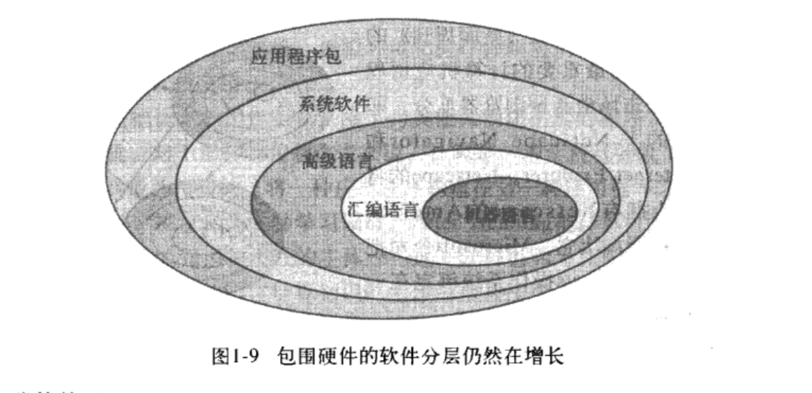
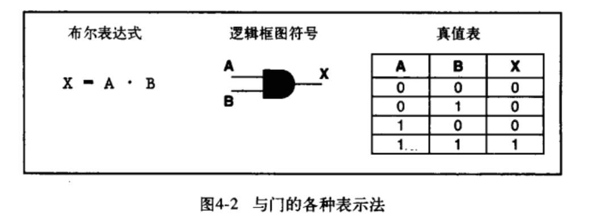
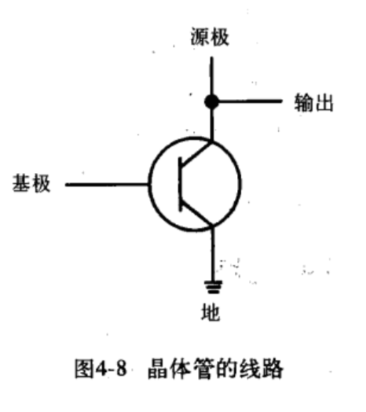
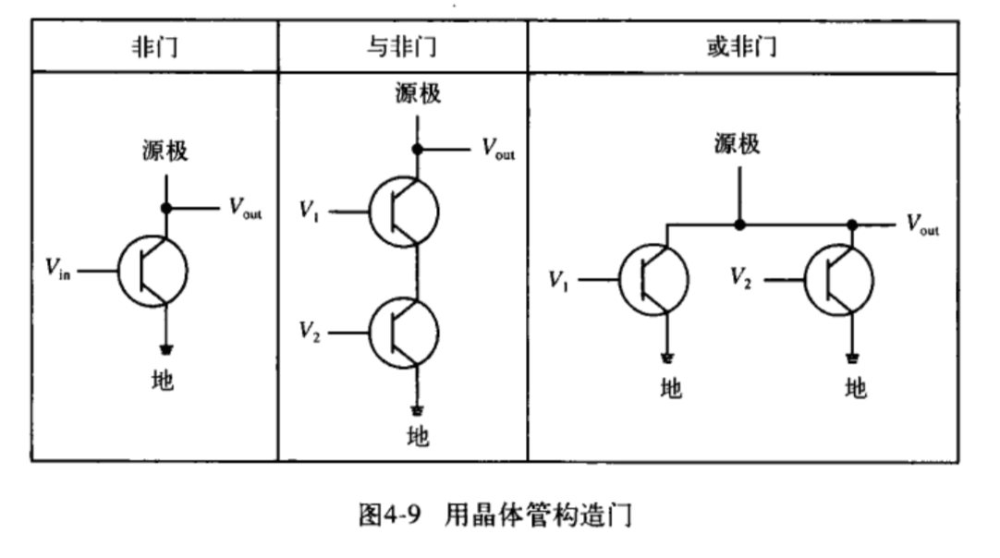
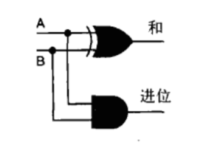
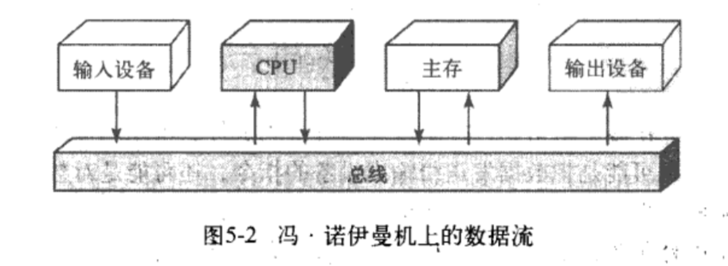

# 读《计算机科学概论》

**关键词**：抽象、概览、分层、计算、预备知识和编程经验

## 简介
作者将计算机系统分成信息层、硬件层、程序设计层、操作系统层、应用程序层和通信层这 6 个层，以自底向上，从内到外，从具体到抽象的方式介绍了计算机如何运作，它们可以做什么以及如何使用它解决问题，最后还探讨了计算机的局限，也就是它不能做什么。

通过阅读这本书，我们可以知道，从普通用户的角度来看，我们现在所使用的计算机是怎么实现的，从应用程序开发者的角度来看，我们平常开发时所用的语言和框架都处在哪一层、跟其它层有什么关系。我们会从细节中脱离出来，退后一步看到更大的世界。

读完这本书，你会/应该知道：
- 计算机系统可以分为哪几层
- 计算机科学包括哪些领域
- 在计算机的世界里，抽象意味着什么
- 计算机系统的发展历史
- 从代码变成可执行的程序再到程序运行这一过程发生了什么
- 计算机能干什么，以及不能干什么

## 目录

- 第一部分 基础篇
  - 第 1 章 全景图
- 第二部分 信息层
  - 第 2 章 二进制值和记数系统
  - 第 3 章 数据表示法
- 第三部分 硬件层
  - 第 4 章 门和电路
  - 第 5 章 计算部件
- 第四部分 程序设计层
  - 第 6 章 问题求解和算法设计
  - 第 7 章 低级程序设计语言
  - 第 8 章 高级程序设计语言
  - 第 9 章 抽象数据类型和算法
- 第五部分 操作系统层
  - 第 10 章 操作系统
  - 第 11 章 文件系统和目录
- 第六部分 应用程序层
  - 第 12 章 信息系统
  - 第 13 章 人工智能
  - 第 14 章 模拟、图形学和其他应用程序
- 第七部分 通信层
  - 第 15 章 网络
  - 第 16 章 万维网
- 第八部分 总结
  - 第 17 章 计算的限制

-----------

## 第一部分 基础篇

### 第 1 章 全景图

#### 1. 计算系统
- 什么是计算系统：计算系统不是计算机系统，计算机是一种设备，而计算系统是一种动态实体，用于解决问题以及与它所处的环境进行交互
  - 硬件
  - 软件
  - 数据
- 计算系统的分层
  - 信息：计算机上的信息都是通过二进制来表示的
  - 硬件：由计算机系统的物理硬件（门和电路、专用元件）组成
  - 程序设计：负责处理软件、用于实现计算的指令以及管理数据，程序是解决问题的工具
  - 操作系统：管理计算机的资源，管理硬件设备、程序和数据间的交互方式
  - 应用程序：用计算机解决真实世界的问题
  - 通信：计算机连接到网络上，可以共享信息和资源，网络让计算机不再孤立
- 我们很容易掌握细节，但却失去了全局观念，所以在阅读这本书的过程中，请记住计算系统的全景图
- 抽象，抽象与计算的关系
  - 抽象是一种思考问题的方式，它删除或隐藏了复杂的细节
  - 人在同一时间所关注的事物是有限的，通过抽象，我们只需要关注一些必需的信息，忽略无关紧要的细节
  - 抽象是计算的关键，计算系统的分层表现了抽象的概念
  - 例子
    - 开汽车
    - 抽象艺术

#### 2. 计算的历史
- 硬件
  - 早期历史（Before 1951）
    - 算盘
    - 分析机
    - UNIVAC I
  - 第一代（1951~1959）
    - 存储元件：**真空管**
    - 主存储器：磁鼓
    - 外围设备
      - 输入设备：读卡机、磁带驱动器
      - 输出设备：穿孔卡片
      - 辅助存储设备：磁带（顺序存储）
  - 第二代（1959~1965）
    - 存储元件：**晶体管**
    - 主存储器：磁芯（能够即时访问信息）
    - 辅助存储设备：磁盘
  - 第三代（1965~1971）
    - 主要特征：**集成电路（IC）**
    - 带有键盘和鼠标的输入/输出设备：终端
    - 摩尔定律：一个集成电路板上能够容纳的电路的数量每年增长一倍
  - 第四代（1971~？）
    - 主要特征：**大规模集成化**
    - 摩尔定律：一个集成电路板上能够容纳的电路的数量每 18 个月增长一倍
    - 出现了个人计算机
    - 工作站
    - 并行计算
    - 连网
- 软件
  - 关键点
    - 计算机的用户角色的转变和分化
    - 系统程序员和应用程序员
  - 时间线
    - 第一代（1951~1959）
      - 机器语言
      - 汇编语言
      - 汇编器：将汇编语言翻译成机器语言
      - 出现了系统程序员，也就是编写辅助工具的程序设计员
    - 第二代（1959~1965）
      - 高级语言
        - FORTRAN
        - COBOL
        - Lisp
      - 编译器：将高级语言翻译成汇编语言后，再由汇编语言翻译成机器语言
      - 系统程序员的角色变得更加明显
        - 系统程序员：编写汇编器、编译器这些工具
        - 应用程序设计员：使用工具编写程序
    - 第三代（1965~1971）
      - 出现了操作系统，控制计算机资源，操作系统就是一种决定何时运行什么程序的程序
      - 实用程序、操作系统和语言翻译程序共同构成了系统软件
      - 分时
      - 计算机用户的概念出现了，他们不再是传统意义上的程序员
    - 第四代（1971~1989）
      - 结构化程序设计方法
        - Pascal
        - BASIC
        - C、C++
      - 更强大的操作系统
        - UNIX
        - PC-DOS
        - MS-DOS
        - Macintosh（引入了鼠标和点击式的图形界面，彻底改变了人机交互）
    - 第五代（1990~今天）
      - 微软的崛起
      - 面向对象程序设计
        - Java 开始成为主流
      - 万维网（World Wide Web）的出现
      - 每个人都成为了计算机用户

#### 3. 计算工具和计算学科

- 计算学科分区
  - 系统分区：构建计算工具
    - 算法和数据结构
    - 程序设计语言
    - （计算机）体系结构
    - 操作系统
    - 软件方法学和工程学
    - 人机交互
  - 应用分区：把计算机作为工具
    - 数值和符号计算
    - 数据库和信息检索
    - 人工智能和机器人技术
    - 图形学
    - 组织信息学
    - 生物信息学

> 在第一部分中，作者强调了抽象的重要性，另外，计算系统和编程语言的分层理论，以及这里没有提到的计算机网络分层，再加上程序员角色的分化，让我联想到金旭亮老师提到的学习方法——我们实际上只需要深入了解 N-1 层和 N+1 层就够了，其他层跟我们日常工作关系不大，先有了“全景图”，可以等到需要时再去深入了解其它层的细节。

## 第二部分 信息层

### 第 2 章 二进制数值和记数系统
#### 1. 数字和计算

- 所有使用计算机存储和管理的信息类型最终都是以数字形式存储的，也就是说，在计算上存储和传输的信息都是数字 0 和 1。
- 数字的分类
  - 有理数
    - 整数
      - 自然数
      - 负数
    - 实数
  - 无理数

#### 2. 位置记数法
- 基数：规定一个记数系统使用的数字量，比如，二进制的基数就是 2，所以二进制只能用 0 和 1 表示
- 位置计数法
- 二进制、八进制和十六进制是相关的，因为它们的基数都是 2 的幂
- 进制转换
- 二进制数值和计算机
  - 现代计算机中，所有的信息都是用二进制数值表示的，原因在于计算机中的每个存储位只有高电压和低电压两种信号
  - 每个存储单元成为一个二进制数字（或者称作“位”），把 8 个“位”组合在一起就构成了字节，字节组合在一起就构成了字。
  - 字中的位数成为计算机的字长。比如，半字（2字节或16位）、全字（4字节或32位）

### 第 3 章 数据表示法

#### 1. 数据和计算机

计算机能够处理的信息包括：         
- 数字
- 文本
- 音频
- 图像和图形
- 视频

这些数据最终都被存储为二进制数字，每个文档、图像和广播讲话都将被表示为由 0 和 1 组成的字符串。

数据压缩：      
- 什么是数据压缩
- 为什么要压缩数据
- 压缩率
- 有损压缩和无损压缩

模拟数据和数字数据  
- 数据可以分为两类
  - 模拟数据
  - 数字数据    
- 自然界的大部分都是连续的和无限的，而计算机是有限的。因此计算机不能很好滴处理模拟数据，我们需要数字化数据，并用二进制表示。
  - 什么是数字化？
    - 把连续的信息分割成多个片段，并提取其中的关键片段
  - 为什么用二进制而不是十进制或者其他记数系统呢？
    - 因为如果存储和管理数据的设备只需要表示两种数字化之一，那么费用要小得多，而且也可靠得多。另外，如果电信号只传输二进制数据，也易于维护。

二进制表示法    
- 二进制的固有特性：一个位只能是 0 或 1，没有其他的可能，因此，一个位只能表示两种状态之一
- 如果要表示多于两种状态，就需要多个位，n 位二进制数字能表示 2^n 种状态

#### 2. 数字数据的表示法

- 负数表示法
  - 符号数值表示法
  - **补码数值表示法**
    - 如何理解“可以通过取反加 1 得到一个二进制数的负数”？
    - 溢出
- 实数表示法
  - 十进制浮点表示法
  - 二进制浮点表示法
  - 进制转换
  - 科学计数法

十进制补码表示法示意图如下：

二进制补码表示法示意图如下：

#### 3. 文本表示法

- 如何表示字符：赋予每个字符一个二进制字符串
- 字符集
  - ASCII 字符集
  - Unicode 字符集
  - 文本压缩
    - 关键字编码
    - 行程长度编码
    - 赫夫曼编码

#### 4. 音频信息表示法

- 声音的原理
- 数字化声波
- 音频格式
  - MP3 
  - WAV

#### 5. 图像和图形的表示法

- 颜色表示法
  - RGB 和 ARGB
  - 色深度：表示颜色的位数
    - 增强彩色（16位）
    - 真彩色（24位）
- 数字化图像和图形
  - 图像的数字化：像素和分辨率
  - 图像表示法
    - 光栅图形格式（位图，bitmap）
      - GIF
      - JPEG
      - PNG
    - 矢量图形表示法
      - Flash
      - SVG

#### 6. 视频表示法

- 视频信息的数字化
- 视频压缩（视频编译码器）
  - 时间压缩
  - 空间压缩
- 视频编译码器
  - MPEG
  - Real Video

> 读这一部分两个最大的收获就是，一是知道了从文本到图片、音视频这么多种形式的信息是怎么表示的，有了一个全面的了解；另一个意外发现就是知道补码原来是这么回事，原来十进制也有补码数值表示法。

## 第三部分 硬件层

### 第 4 章 门和电路

#### 1. 计算机和电学

- 计算机是电子设备，它的大多数基础硬件元件控制着电流。
- 任何电信号都有电压电平，我们根据信号的电压电平区分信号的值（0 或 1）。
- 门：对电信号执行基本运算的设备，一个门接收一个或多个输入信号，生成一个输出信号
- 电路：**由门组合而成**，可以执行复杂的任务，比如执行算数运算和存储值。
- 描述门和电路的表示法：
  - 布尔表达式
  - 逻辑框图
  - 真值表

#### 2. 门

- 6 种基本类型的门
  - 非（NOT）门
  - 与（AND）门
  - 或（OR）门
  - 异或（XOR）门
  - 与非（NAND）门
  - 或非（NOR）门

#### 3. 门的构造

- 门的构造：门使用**晶体管**建立输入值和输出值之间的映射
- 晶体管
  - 晶体管由半导体材料制作而成，半导体是一种既不是良好的导体也不是绝缘体的材料
  - 晶体管可以扮演的角色有两种，既可以做传导电流的电线，又可以做组织电流的电阻器，输入信号的电压电平决定了晶体管的角色。
  - 晶体管只能是开（生成高电压输出）或关（生成低电压输出）两种状态，由基极电信号决定。
- 如何用晶体管构造门（见示意图）

#### 4. 电路

- 电路
  - 组合电路：输入值明确决定了输出值
  - 时序电路：输出是输入值和电路现有状态的函数，因此，时序电路通常涉及信息存储
- 组合电路：把一个门的输出作为另一个门的输入，就可以把门组合成电路
- 布尔代数的一些属性
  - 交换律
  - 结合律
  - 分配律
  - 恒等
  - 余式
  - 德·摩根定律
    - `(A x B)' = A' + B'`
    - `(A + B)' = A' x B'`
- 加法器：计算机中最基本的加法运算是由专门电路加法器执行的
  - 半加器：计算两个数位的和并生成正确进位的电路，比如计算 `1 + 1 = 10` 就需要半加器电路
    - 二进制的加法运算结果包括两部分：和与进位，所以，半加器有两条输出线（见示意图）
      - 和对应的是异或门
      - 进位对应的是与门
  - 半加器不会把进位输入考虑在计算之内，所以半加器只能计算两个数位的和（比如 `1 + 1 = 10`），而不能计算两个多位二进制的和（比如 `11 + 01 = 100`）。
  - 全加器：计算两个数位的和，并考虑进位输入值的电路
- 多路复用器：使用一些输入控制信号决定用哪条输入数据线发送输出信号的电路
  - 用通俗的话来讲，多路复用器就是把n个输入排列组合的结果分别输出到 2^n 个不同的输出线路（见示意图）
  - 多路复用器可以有任意多条输入线和相应的控制线。一般来讲，n 条输入控制线的二进制值决定了选择 2^n 条数据线中的哪一条作为输出
- 多路分配器

电路逻辑框图：

半加器逻辑框图：  

半加器逻真值表：  

全加器逻辑框图和真值表：

多路复用器框图：

多路复用器真值表：

#### 5. 存储器电路

- 时序电路可以用来作为存储器
- 存储器电路的特点：电路的输出信号被当做电路的输入信号，也就是说，电路的下一个状态部分是由当前状态决定的
- S-R 锁存器
  - 如何将一个值存入 S-R 锁存器？

#### 6. 集成电路

- 集成电路（芯片，IC）是嵌入了多个门的硅片。
- 集成电路是根据它们包含的门数目来分类的
  - 小规模集成（门数：1~10）
  - 中规模集成（门数：10~100）
  - 大规模集成（门数：100~100 000）
  - 超大规模集成（门数：多于 100 000）

#### 7. CPU 芯片

- 计算机中最重要的集成电路就是中央处理器（CPU）
- CPU 是一种具有输入线和输出线的高级电路
- 每个 CPU 芯片有大量的引脚，计算机系统的所有通信都是通过这些引脚完成的。这些通信把 CPU 和本身也是高级电路的存储器和 I/O 设备连接在一起。

#### 小结：

这一章我们讨论了计算机如何通过控制最底层的**电流**进行运算，由于我们讨论的是使用**二进制**信息的数字计算机，所以我们只关注两个电压范围，分别表示为二进制数字1或0，电流由称为**门**的电子设备操纵，门负责执行基本的逻辑运算，如非运算，与运算和或运算。门是由一个成多个**晶体管**创建的，晶体管的发明使计算学发生了翻天覆地的变化。 

把一个们的输出作为另一个门的输人，可以把门组合成**电路**，仔细设计这些电路，可以创建出能执行更复杂任务（如求和，多路复用和存储数据）的没备，门的集合，或者说完整的电路，常常被嵌入在一个**集成电路（或芯片）**中，这引出了**中央处理器**的概念，

### 第 5 章 计算部件

#### 1. 独立的计算机部件

- 如何看懂一个计算机广告中的术语、配置参数
  - 处理器速度
  - 内存大小
  - 硬盘大小
  - 显示器像素
  - ...

#### 2. 存储程序的概念——冯·诺伊曼体系结构

- 冯·诺伊曼体系结构：当代计算机设计的理论基础
  - 冯·诺伊曼体系结构是一种将程序指令存储器和数据存储器合并在一起的计算机设计概念结构。
  - 主要特征
    - 数据和指令可以存储在一起
    - 处理信息的部件和存储信息的部件是独立的
  - 定义了计算机组成部分
    - 内存：存放数据和指令
    - 算术逻辑部件(ALU)：执行算术和逻辑运算
      - 寄存器：CPU 上的一小块存储区域，用于存储中间值或特殊数据。
    - 输入设备：把数据从外界输入到计算机中
    - 输出设备：把数据从计算机中输出到外界
    - 控制器：掌管着读取-执行周期，控制其他部件的动作，从而执行指令序列的计算机部件。
      - 指令存储器：存放当前执行的指令的寄存器
      - 程序计数器：存放下一条要执行的指令的寄存器
      - 中央处理器（CPU）：算术逻辑部件和控制器的组合，是计算机用于解释和执行指令的“大脑”。
      - 总线：把机器的主要组成部分连接在一起的一组电线，数据通过总线在计算机中传递
      - 主板：个人计算机中的主电路板
  - 延伸阅读：[冯·诺伊曼结构 - 维基百科](https://zh.wikipedia.org/wiki/%E5%86%AF%C2%B7%E8%AF%BA%E4%BC%8A%E6%9B%BC%E7%BB%93%E6%9E%84)、[冯·诺依曼体系结构 - 百度百科](https://baike.baidu.com/item/%E5%86%AF%C2%B7%E8%AF%BA%E4%BE%9D%E6%9B%BC%E4%BD%93%E7%B3%BB%E7%BB%93%E6%9E%84/4690854?fromtitle=%E5%86%AF%E8%AF%BA%E4%BE%9D%E6%9B%BC%E4%BD%93%E7%B3%BB%E7%BB%93%E6%9E%84&fromid=213926)
- 读取-执行周期
  - 根据冯诺伊曼的理论，数据和指令都存储在内存中，以同样的方式处理，也就是说数据和指令都是可以编址的。
  - 指令存储在连续的内存区域中，它们操作的数据存储在另一块内存区域中。
  - 要启动读取-执行周期，第一条指令的地址被装入程序计数器，处理周期中的步骤如下：
    - 从内存中读取指令
    - 译解指令
    - 如果需要，获取数据
    - 执行指令
- RAM 和 ROM
  - ROM 要解决的问题是：RAM 中的数据可以随便读写，但是随意地更改程序代价很高
  - RAM：随机存取存储器，可读可写；存储在其中的数据可更改；关闭电源后，RAM 不再保留它的位配置
  - ROM：只读存储器，只读；存储在其中的数据不可更改；关闭电源后，ROM 会保留它的位配置，它的位组合是永久性的，所以用它存储计算机启动自身需要的指令
- 二级存储设备：在计算机不运行的时候保存数据
  - 磁带
  - 磁盘
    - 硬盘
    - 软盘
  - CD、DVD
- 触摸屏：一种外围设备，同时具备输入输出功能
  - 电阻触摸屏
  - 电容触摸屏
  - 红外触摸屏
  - 声表面波触摸屏

冯·诺伊曼体系结构：

总线：

读取-执行周期：

#### 3. 非冯·诺伊曼体系结构

- 并行处理系统：处理器不止一个，能够进行并行计算，从而加速处理过程
  - 同步处理
  - 流水线操作
  - 共享内存配置

## 第四部分 程序设计层

### 第 6 章 问题求解和算法设计

#### 1. 问题求解

- 计算机与问题求解
  - 首先要知道有些问题计算机可以解决，而另外一些问题是计算机不能解决的
  - 如果不告诉计算机做什么，它什么也做不了，它**不能自己分析问题并提出问题的解决方案**。所以必须靠人（程序员）去分析这些问题，并为解决问题开发指令集（程序），然后让计算机执行这些指令。
  - 如果计算机不能自己解决问题，那么计算机还有什么用呢？其实，只要为计算机编写了解决方案，它就能够对不同的情况和数据快速一致地反复执行这个方案，它**把人们从枯燥重复的任务中解放了出来**
- 如何解决问题（Polya 问题求解策略）
  - 第一步，必须理解问题
  - 第二步，寻找相同或相似的问题，看看是否已经有可供参考的解决方案，然后用分治法解决。
    - 永远不要彻底重新做一件事，如果解决方案已经存在了，直接用这种方案就可以了。
  - 第三步，测试方案
  - 第四步，分析得到的解决方案
- 分治法和抽象
  - 大问题是子问题的抽象，子问题是大问题的具体化

#### 2. 算法

- 算法是什么
  - 在计算领域，算法是指在有限的时间内用有限的数据解决问题或子问题的明确指令集合
  - 用通俗的话理解，算法就是解决问题的步骤
- 计算领域的问题求解过程
  - 分析和说明阶段：理解、分析问题
  - 算法开发阶段：设计解决方案和“预演”
  - 实现阶段：编码和测试验证，也就是把解决方案转换成计算机能够执行的形式
  - 维护阶段：使用程序、修改程序，不断修正
- 设计算法的两种方法（这两种方法都是基于分治策略的）
  - 自顶向下设计（又称功能分解）
  - 面向对象设计（OOD）

#### 3. 伪代码

- 伪代码：它不是代码，它是用来表示算法的语言，属于抽象层面的语言。伪代码并非一种计算机语言，而更像一种人们用来说明操作的便捷语言。
- 语言层包围着真正的机器。虽然伪代码并没有特定的语法规则，但必须要表示出下面的概念：
  - 变量
  - 赋值
  - 输入/输出
  - 重复（迭代、循环）
  - `if-then` 选择
  - `if-then-else` 选择

#### 4. 两种设计方法
- 自顶向下
  - 自顶向下设计：把问题分解成一套子问题，然后再继续分解子问题。这一过程将一直持续到每个子问题足够基础，不再需要进一步分解为止。
    - 我们创造了一种分层结所来表示问题和子问题（称为模块）之间的关系，这种结构也称为**树形结构**，在树形结构中，每一层中的模块都可以调用下层模块的服务，这些模块是算法的基本构件
    - 把问题分解成子问题、模块或者片段的目的，是要独立地解决每个模块
  - 设计算法的过程：写下主要步骤，它们将成为主要模块。然后开始开发第一层模块中的主要步骤的细节。如果还不知道如何解决一个步骤，或者觉得细节问题很棘手，那么给这个模块起一个名字，继续开发下一个模块。之后，可以把这个名字扩展成低级的模块。这个过程将在多个层次中重复，把每个任务扩展成最小的细节。需要扩展的步骤是**抽象步骤**，不需要扩展的步骤是**具体步骤**。如果一个任务困难繁重，可以把它的细节推到较低层次中。这一过程也可以应用到棘手的子任务上。**整个问题最终将被分解成能够解决的单元**。
  - 编写自顶向下的设计方案与编写论文的大纲相似，这种解决问题的方法在生活中也很常见。（注：在《把时间当作朋友》和《软技能：代码之外的求生指南》中也都提到了通过拆分任务来解决大问题的）
- 面向对象
  - 面向对象设计：是用叫做**对象**的独立实体生成解决方案的问题求解方法
  - 对象：由数据和处理数据的操作构成
  - 面向对象设计的重点是对象以及它们在问题中的交互作用

> 解决计算机问题的着手点是先问自己如果要手动地解决这个问题该怎么解决。因为如果我们不能手动地处理一个任务，那对这个任务的理解就不够透彻，不足以编写算法。通常，手动解决方案是计算机解决方案的雏形。

#### 5. 几个重要思想
- 信息隐蔽（延迟细节设计）：高层设计隐蔽了细节，对于每个特定的分层，设计者只考虑与之相关的细节
- 抽象：信息隐蔽是隐藏细节的做法，而抽象是隐藏细节后的结果，抽象是复杂系统的一种模型，只包括对观察者来说必需的细节
  - 在算法设计中，高层的模块是它下面的模块的抽象
- 事物命名
- 程序设计语言
  - 用程序设计语言编写的指令能够被翻译层计算机可以直接执行的指令
  - 程序设计语言是一种人造语言，由符号、专用字和一套规则组成，用于构造程序，也就是表示成计算机能够理解的指令序列
  - 程序设计语言由两部分组成：
    - 语法：规定了如何组织语言中的指令
    - 语义：赋予了每条指令的含义
- 测试

> 抽象是人们用来处理复杂食物的最强有力的工具。

### 第 7 章 低级程序设计语言

#### 1. 计算机操作

- 不论是表示算法的所有符号，还是用于实现算法的程序设计语言，都必须反映出计算机能够执行的操作类型
- 计算机最基本的 5 种操作类型
  - 存储
  - 检索
  - 处理
  - 输入
  - 输出

#### 2. 抽象的分层

根据编程语言的发展历程，从硬件附带的语言——机器语言，到低级程序设计语言——汇编语言，再到高级程序设计语言，每前进一个阶段，语言自身就变得越抽象，也就是说，一个语句所包含的处理变得越来越复杂。

#### 3. 机器语言
- 机器语言：由计算机直接使用的二进制编码指令构成的语言
- 计算机指令是如何表示的？
  - 每种处理器都有自己专用的机器指令集合。这些指令
是处理器唯一真正能够执行的指令。由于指令的数量有限，所以处理器的设计者就列出所有
的指令，给每个指令分配一个二进制代码，用来表示它们。这与第3章中介绍的表示字符数
据的方法相似。
- 处理器是如何识别指令的呢？
  - CPU 的电子器件本来就能够识别专用
命令的二进制表示，因此,计算机必须参考的命令的真实清单并不存在。CPU 把这个清单嵌
入了自己的设计。
- 机器语言指令是如何被执行的呢？
  - 每条机器语言指令只能执行一个非常低级的任务。在机器语言中,处理过程中每一个微
小的步骤都必须明确地编码。即使是求两个数的和这样的小任务,也需要三条用二进制编写
的指令。程序员必须记住每组二进制数对应的是什么指令。如第1章所述,机器语言的程序员
必须对数字很敏感,而且非常注意细节。
- 虚拟计算机
  - 主要特性和构造
  - 指令格式：`指令 = 指令说明符 + 操作数说明符`
  - 编写机器指令
  - 执行过程
- 示例程序

#### 4. 汇编语言

- 汇编语言是一种低级语言，用助记码表示特定计算机的机器语言指令

#### 5. 其他重要思想

### 第 8 章 高级程序设计语言

#### 1. 翻译过程
- 编译器：把用高级语言编写的程序翻译成机器码的程序。
  - 任何计算机只要具有一种高级语言的编译器,就能运行用这种语言编写的程序。注意,编译器是一种程序,因此,要编译一个程序,就必须具有这个编译器在特定机器上的机器码版本。想要在多种类型的机器上使用一种高级语言,就要具备这种语言的多个编译器。
- 解释器：输入用高级语言编写的程序,指导计算机执行每个语句指定的动作的程序。
  - 解释器是一种翻译程序,用于解释和执行语句序列。 
  - 与汇编器和编译器只是输出机器码不同的是,解释器在翻译过语句之后会立即执行这个语句。可以把解释器看作编写程序所使用的语言的模拟器或虚拟机。
  - Java 和字节码
    - 由于软件解释器非常复杂,所以用要解释的语言编写的程序通常比要编译的程序的运行速度慢很多 因此,要编译的语言发展成了主流,以致产生了Java。
    - 在Java的设计中,可移植性是最重要的特性。为了达到最佳可移植性,Java将被编译成一种标准机器语言一**字节码**。
    - 怎么会存在标准机器语言呢?
      - 字节码(bytecode)：编译Java源代码使用的标准机器语言
      - 一种名为 **JVM（Java虚拟机）**的软件解释器将接收字节码程序,然后执行它。也就是说,字节码不是某个特定硬件处理器的机器语言,任何县有JVM的机器都可以运行编译过的Java程序。
    - **注意：**标准化的高级语言实现的可移植性与把Java程序翻译成字节码然后在JVM上解释它所实现的可移植性是不同的。
      - 用高级语言编写的程序能够在任何具有适合的编译器的机器上编译和运行,程序将被翻译成计算机能够直接执行的机器码。而Java程序则是被编译成字节码,编译过的字节码程序可以在任何具有JVM解释器的机器上运行。也就是说,Java编译器输出的程序将被解释,而不是被执行。Java程序总是被翻译成字节码。

#### 2. 编程范式
- 命令式
  - 结构化
    - 过程式：顺序执行，代表语言有 Basic、Fortran、C、Pascal
    - 面向对象：Smalltalk
  - 非结构化
    - COBOL
- 声明式
  - 函数式：Lisp、Scheme
  - 逻辑式：Prolog

#### 3. 命令式语言的特性
- 布尔表达式
- 强类型化：大多数高级语言在关联内存单元和标识符时，要求说明这些内存单元存储的数据类型，如果程序中的某个语句要把类型不符的值存入一个变量,就会出现错误消息,只有类型相符
的值才能存入变量
  - 数据类型
    - 为什么需要数据类型？
      - 数据是表示信息的物理符号。在计算机内部,数据和指令都是二进制位的组合。计算机能够执行一条指令,是因为这条指令的地址被载入了程序计数器,指令被载入了指令寄存器。被执行的位组合同样可以表示整数、实数、字符或布尔值,关键看**计算机如何解释位组合**
    - 数据类型可以分为两大类
      - 简单数据类型
        - 整数
        - 实数
        - 字符
        - 布尔值
      - 复合数据类型
        - 字符串
  - 声明：把变量、动作或语言中的其他实体与标识符关联起来的语句,使程序员可以通过名字引用这些项目。
- 输入/输出结构
  - 字符流和数据类型转换
- 控制结构
  - 顺序执行
  - 选择语句
  - 循环语句
    - 计数控制
    - 事件控制
  - 子程序语句（函数/方法）
    - 返回值
    - 参数传递
    - 参数传递方式
      - 值参：由调用部件传入实参的副本的形参
      - 引用参数：由调用部件传入实参的地址的形参
  - 递归
    - 基本情况
    - 一般情况
  - 异步处理
  - 嵌套逻辑
- 复合数据类型
  - 记录（结构体）->异构项目的集合
  - 数组 -> 同构项目的集合

#### 4. 面向对象语言的特性
- 封装：实施信息隐蔽的特性，目的是为了控制对细节的访问
- 继承：可以从一个已有的类，派生出一个具有相同属性和方法的类，然后可以向这个新的类中添加一些自己特有的属性和方法
- 多态：不同的子类中的同名方法具有不同的实现

**延伸阅读：**      
- [编程语言 - Wikipedia](https://zh.wikipedia.org/wiki/%E7%BC%96%E7%A8%8B%E8%AF%AD%E8%A8%80)

### 第 9 章 抽象数据类型和算法

#### 1. 抽象数据类型
- 抽象数据类型的定义
- 三个层次
  - 应用层
  - 逻辑层
  - 实现层
- 容器

#### 2. 算法的实现
- 基于数组的实现
- 链式实现

#### 3. 列表
- 三个特征
  - 同构
  - 线性
  - 变长

#### 4. 排序
- 选择排序
- 冒泡排序
- 快速排序（分而治之）

#### 5.  二分查找法
- 前提：有序

#### 6. 栈和队列
- 栈（LIFO）
- 队列（FIFO）

#### 7. 树和图（非线性数据类型）
- 树
  - 二叉树
  - 二叉查找树：任何节点的值大于左子树节点的值，小于右子树节点的值
  - 二叉树的遍历
- 图
  - 有向图和无向图

#### 8. 标准库
- 很多语言的标准库中已经实现了一些现成的算法，我们不需要重复造轮子

**延伸阅读：**      
- [抽象数据类型 - 维基百科](https://zh.wikipedia.org/wiki/%E6%8A%BD%E8%B1%A1%E8%B3%87%E6%96%99%E5%9E%8B%E5%88%A5)

## 第五部分 操作系统层

### 第 10 章 操作系统

#### 1. 操作系统的角色

- 计算机的操作系统把硬件和软件紧密地结合在一起,它是其他软件依附的基础,井且允许我们编写与机器进行交互的程序。就像交警要使通过十字路口的车流井井有条一样,操作系统要使通过计算机系统的程序流井然有序。
- 内存、进程和 CPU 管理
- 批处理
- 分时操作
- 其他
  - 网络
  - 设备驱动
  - 实时系统

#### 2. 内存管理

- 程序是怎样被加载到内存中的？
- 操作系统如何管理程序内存
  - 逻辑地址
  - 物理地址
- 几种不同的内存管理方式
  - 单块内存管理
  - 分区内存管理
  - 页式内存管理
    - 分页
    - 请求分页
    - 页面交换
    - 虚拟内存
    - 系统颠簸

#### 3. 进程管理

- 进程的几种状态
- 进程控制块（PCB）
  - 上下文切换

#### 4. CPU 调度
- 抢先调度和非抢先调度
- 调度方法
  - 先到先服务
  - 最短作业优先
  - 循环调度法

## 第 11 章 文件系统和目录

1. 文件系统

2. 目录

3. 磁盘调度

### 第六部分 应用程序层

#### 第 12 章 信息系统
12.1 信息管理
12.2 电子制表软件
12.3 数据库管理系统
12.4 信息安全

#### 第 13 章 人工智能
13.1 思维机
13.2 知识表示
13.3 专家系统
13.4 神经网络
13.5 自然语言处理
13.6 机器人学

#### 第 14 章 模拟、图形学和其他应用程序

1. 什么是模拟

- 复杂系统
- 模型
- 构造模型
- 排队系统
- 气象模型
- 其他模型
- 必要的计算能力

2. 计算机图形学

3. 嵌入式系统

4. 电子商务

5. 计算机安全

### 第七部分 通信层

#### 第 15 章 网络

15.1 连网
15.2 开放式系统和协议
15.3 网络地址

#### 第 16 章 万维网
16.1 Web 简介
16.2 HTML
16.3 交互式网页（动态网页）
  - Java 小程序
  - Java 服务器页
16.4 JavaScript
16.5 XML 和 JSON

### 第八部分 总结

#### 第 17 章 计算的限制
17.1 硬件
17.2 软件
17.3 问题

## 延伸阅读
- 《计算机是怎样跑起来的》
- 《程序是怎样跑起来的》
- 《编码：隐匿在计算机软硬件背后的语言》
- 《深入理解计算机系统》

